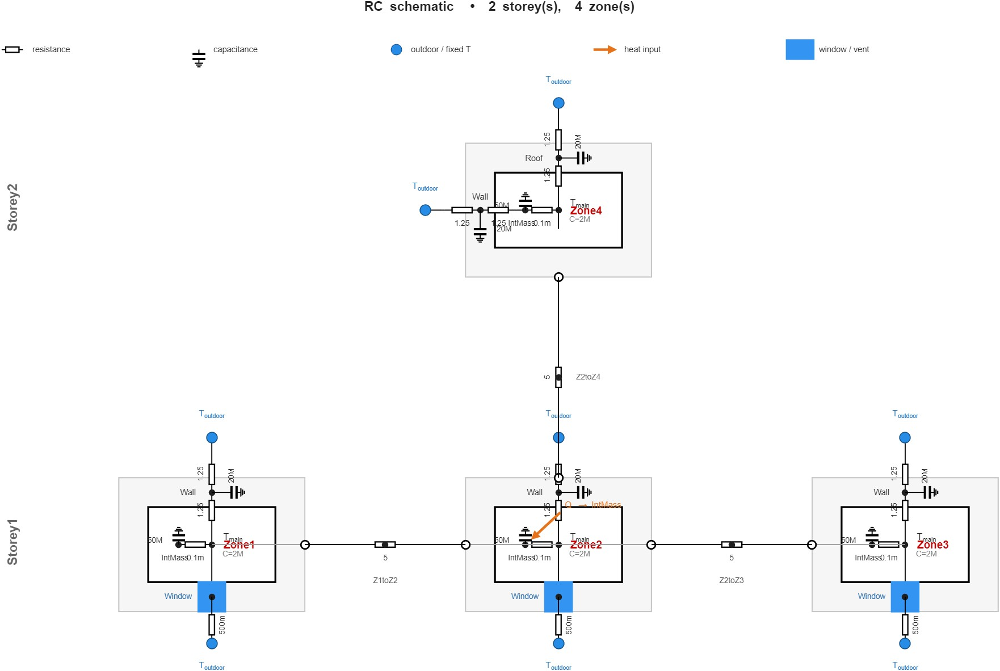

# RC Building Simulation
This MATLAB library enables RC development of multi zone buildings.

 

## Installation
Just add the main folder to the MATLAB directory or add the directory of the library to your MATLAB path.

## Usage
### 1. Start with creating a new building:
```matlab
B = RCBS.Building();
```

### 2. Then add storey to the building:
```matlab
B.addStorey('Storey1');
B.addStorey('Storey2');
```

### 3. Add zones to the storey with their main thermal capacity:
```matlab
B.Storey1.addZone('Zone1', 'C_main', 2e6);
B.Storey1.addZone('Zone2', 'C_main', 2e6);
B.Storey1.addZone('Zone3', 'C_main', 2e6);
B.Storey2.addZone('Zone4', 'C_main', 2e6);
```

### 4. Add wall, window, internal mass, etc to the zone:
```matlab
B.Storey1.Zone1.addWall(2.5, 2e7, 20, 'Wall');    % R = 2.5 K/W (Good insulator)
B.Storey1.Zone1.addWindow(0.5, 'Window');         % R = 0.5 K/W (A decent window)
B.Storey1.Zone1.addInternalMass(1e-4, 5e7, 20, 'IntMass'); 
```

### 5. Define connections between zones with a thermal resistor:
```matlab
B.Storey1.Zone1.connectToZone(B.Storey1.Zone2, 5.0, 'Z1toZ2');
B.Storey1.Zone1.connectToZone(B.Storey1.Zone3, 5.0, 'Z1toZ3');
B.Storey1.Zone3.connectToZone(B.Storey2.Zone4, 5.0, 'Z3toZ4');
```

### 6. Define heat sources and add them to zones:
```matlab
heater = @(Bld) ( (hour(Bld.simulation.t) >=6 && hour(Bld.simulation.t) < 9) * 5000 );
B.Storey1.Zone1.connectToExternalSource(heater, 'IntMass');
```

### 7. Define outdoor temperature
```matlab
B.outdoorTempFunc = @(t) 5 + 10*sin(2*pi*(hour(t) + minute(t)/60)/24);
```

### 8. Set simulation condition
```matlab
B.simulation.startDate = datetime(2025,10,1,0,0,0);
B.simulation.timeStep = minutes(10);
```

### 9. Start simulation
```matlab
B.simulate(days(2));
```

### 10. Plot results (temperatures)
```matlab
B.simulation.plotResults();
```

### 11. Visulize the building
```matlab
B.visualize();
```

### 12. Get fulll results
```matlab
TZ1 = B.simulation.results.Storey1.Zone1.T;
TZ4 = B.simulation.results.Storey2.Zone4.T;
```
